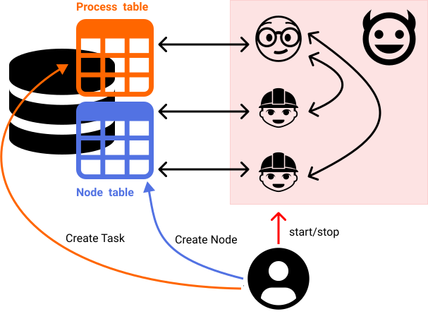

# aiida-process-coordinator

A prototype for a non-RabbitMQ `Process` execution coordinator.

The solution builds on aiida-core's existing database and daemon management infrastructure,
with no additional dependencies:

- Removes a barrier to user adoption (RabbitMQ installation)
- Eliminates "unreachable processes"
- Adds load balancing of processes across workers
- Improved introspection of scheduled processes
- Removes 13 of the 76 aiida-core package primary dependencies
  (kiwipy, aio-pika, aiormq, async-generator, idna, multidict, deprecation, packaging, pamqp, pyparsing, pytray, shortuuid, yarl)

## Terminology

- **Process**: An AiiDA `Process` instance, stored in the database
- **Worker**: A system process, that can execute one or more `Process` to termination
- **Daemon**: A system process, which manages spawning, monitoring and killing of child processes (e.g. workers) and sockets

## What are the requirements for the process coordinator?

These are the major requirements for the coordinator:

- Ensure every submitted AiiDA `Process` is run to termination
- Ensure each AiiDA `Process` is only being executed by one worker at any time
- Handle pause/play and kill requests for Processes
- Handle nested submissions, i.e. Processes that submit sub-Processes, and must wait on their completion before continuing

## Why replace RabbitMQ?

In short:

Since [rabbitmq-server#2990](https://github.com/rabbitmq/rabbitmq-server/pull/2990), RabbitMQ >= 3.7 will timeout a task if it is not finished within 30 minutes; much shorter than most use-cases in AiiDA.
As discussed in [rabbitmq-server#3345](https://github.com/rabbitmq/rabbitmq-server/discussions/3345), this timeout is not controllable on the client side (i.e. by AiiDA), and will mean all users will have to manually add configuration on the server side to turn off this timeout.
This will make AiiDA even less user friendly to get started with and, even if documented, will likely result in a lot of confusion and issues raised.

In detail:

Below is the current schematic of submitting a `Process` in AiiDA:


1. The user starts the AiiDA daemon which spawns one or more workers, that connect as clients (a.k.a consumers) to the RabbitMQ server
2. The user submits a `Process`
3. AiiDA stores the initial `Process` in the database
4. AiiDA sends a task to the RabbitMQ server task queue
5. The RabbitMQ server sends out these task messages to each worker in turn, for one to consume, waiting for an ack(nowledgment)/nack/reject response (see also [Consumer Acknowledgements](https://www.rabbitmq.com/confirms.html))
6. One worker will execute the task and then (ack)nowledge message receipt to the RabbitMQ server (and the task is removed from the queue)
7. If the executing worker loses connection with the RabbitMQ server, the task will be requeued and sent to another worker

This current design has a number of shortcomings:

- It requires users to install and configure RabbitMQ on the machine running AiiDA
  - As mentioned above, this will require additional, advanced configuration for RabbitMQ >= 3.7
  - This increases the learning/deployment barrier for new users
  - RabbitMQ is generally not well understood by new users, or even AiiDA maintainers, and so is difficult to debug/fix issues
  - RabbitMQ is a non-Python dependency, and so it is not as easy for AiiDA to pin version requirements (must use Conda)
- RabbitMQ must be running before any `Process` can be submitted, or actions taken (pause/play/kill)
- This essentially introduces two independent sources where the state of the `Process` is persisted: in the database and in the RabbitMQ server
  - This can lead to "de-syncing" of the sources; if the worker-RabbitMQ connection is lost (leading to RabbitMQ tasking a worker to execute an already running task [aiida-core#4598](https://github.com/aiidateam/aiida-core/issues/4598)), or if the task is lost (leading to `Process`s being left in an un-terminated state [aiida-core#1712](https://github.com/aiidateam/aiida-core/issues/1712))
- The discussion in [rabbitmq-server#3345](https://github.com/rabbitmq/rabbitmq-server/discussions/3345) highlights that AiiDA uses RabbitMQ in a manner it is not intended to be used;
  normal use is to acknowledge a message as soon as it is received (within microseconds),
  whereas AiiDA only acknowledges a message once the process has completed running, which can take many hours.
- To my knowledge, there is no easy way for the user to introspect RabbitMQ; to find out what tasks are outstanding or running.
- It is not easy to backup/move an AiiDA profile with unfinished processes, as this would require also require moving the RabbitMQ's persistent data.
- The Python interface to RabbitMQ goes through multiple layers of abstraction (kiwipy -> aio_pika -> aiormq), making it difficult to debug and maintain.

## Proposed solution

As shown below, the proposed solution essentially replaces the RabbitMQ server with a (singleton) `Process` execution coordinator, spawned by the AiiDA daemon.
This coordinator acts on persisted data in the database, to coordinate execution of `Process`s on workers.



The coordinator and workers form a standard server/client private network, with the coordinator acting as the server and the workers acting as the clients.
The built-in Python [asyncio.streams](https://docs.python.org/3/library/asyncio-stream.html) primitives are used to implement the connections,
and messaging follows a simple JSON protocol.

- The solution only uses existing AiiDA Python dependencies (primarily circus)
- The persistence for executing processes is all situated in the database
  - Introspection/manipulation of this data can be easily implemented with standard database queries
  - The user can submit a process or set an action (pause/play/kill) on a process, with only a connection to the database
- The coordinator also handles "load balancing" of `Process` submitted to workers; submitting new processes to the worker with the least load (by contrast RabbitMQ will submit to the same worker, until it is full)

## The proposal by example

This package implements a mock AiiDA database with sqlite (created on demand), mock processes which wait for 60 seconds, and exposes a CLI mimicking aspects of verdi.

**NOTE**: sqlite does not handle read/write concurrency as well as PostgreSQL, so it is possible to encounter some database locking failures in this prototype (most are accounted for).

It is recommended to run the CLI via [tox](https://tox.readthedocs.io/en/latest/), to auto-create an isolated Python environment
(note you must add a `--` before CLI arguments).

To see all the commands:

```console
$ tox -- --help
Usage: aiida-task [OPTIONS] COMMAND [ARGS]...

Options:
  --version            Show the version and exit.
  -d, --database TEXT  Path to database (or set env AIIDADB)  [default:
                       /Users/chrisjsewell/Documents/GitHub/aiida-task-
                       controller/aiida.sqlite3]

  --help               Show this message and exit.

Commands:
  daemon   Manage the daemon
  process  Manage processes
```

First (before starting the daemon) we submit a number of process to the database:

```console
$ tox process submit 5
Node pk 1 submitted
Node pk 2 submitted
Node pk 3 submitted
Node pk 4 submitted
Node pk 5 submitted
```

This will generate an `aiida.sqlite3` file in the current directory.

We can list the process nodes (from `db_dbnode`) in the standard manner:

```console
$ tox process list
  PK  Modified                    Status
----  --------------------------  --------
   5  2021-09-06 12:39:34.407908  created
   4  2021-09-06 12:39:34.402800  created
   3  2021-09-06 12:39:34.397937  created
   2  2021-09-06 12:39:34.393634  created
   1  2021-09-06 12:39:34.386709  created
```

But now there is also a `db_process` table we can inspect with the scheduled processes to execute:

```console
$ tox process scheduled
  PK  Modified                    Action    Worker PID
----  --------------------------  --------  ------------
   5  2021-09-06 12:39:34.408866
   4  2021-09-06 12:39:34.403676
   3  2021-09-06 12:39:34.398722
   2  2021-09-06 12:39:34.394237
   1  2021-09-06 12:39:34.387872
```

We can also add "actions" to this, like `kill`:

```console
$ tox process kill 3
Scheduled node pk 3 to be killed
$ tox process scheduled
  PK  Modified                    Action    Worker PID
----  --------------------------  --------  ------------
   5  2021-09-06 12:39:34.408866
   4  2021-09-06 12:39:34.403676
   3  2021-09-06 12:39:34.398722  kill
   2  2021-09-06 12:39:34.394237
   1  2021-09-06 12:39:34.387872
```

If we start the daemon, with two workers, the coordinator will distribute the processes evenly to the workers:

```console
$ tox daemon start 2
$ tox daemon status -q
aiida-coordinator:
- '12022'
aiida-workers:
- '12023'
- '12024'
circusd-stats:
- '12025'
$ tox process scheduled
  PK  Modified                    Action      Worker PID
----  --------------------------  --------  ------------
   5  2021-09-06 12:46:52.976776                   12024
   4  2021-09-06 12:46:52.971709                   12023
   2  2021-09-06 12:46:52.966902                   12024
   1  2021-09-06 12:46:52.961325                   12023
$ tox process list
  PK  Modified                    Status
----  --------------------------  --------
   3  2021-09-06 12:46:52.993646  killed
   5  2021-09-06 12:46:52.990090  running
   4  2021-09-06 12:46:52.986570  running
   2  2021-09-06 12:46:52.985670  running
   1  2021-09-06 12:46:52.982983  running
```

If we then decrease the number of workers, the coordinator will re-distribute the processes to remaining workers:

```console
$ tox daemon decr
$ tox process scheduled
  PK  Modified                    Action      Worker PID
----  --------------------------  --------  ------------
   4  2021-09-06 12:47:36.919519                   12024
   1  2021-09-06 12:47:36.913779                   12024
   5  2021-09-06 12:46:52.976776                   12024
   2  2021-09-06 12:46:52.966902                   12024
```

If we stop the daemon part way through, and re-start with a single worker, the coordinator will re-assign the processes to that worker:

Once completed, the `db_dbprocess` table will be empty, and the `db_dbnode` table will contain all terminated processes:

```console
$ tox process scheduled
PK    Modified    Action    Worker PID
----  ----------  --------  ------------
$ tox process list
  PK  Modified                    Status
----  --------------------------  --------
   4  2021-09-06 12:48:36.917000  finished
   1  2021-09-06 12:48:36.912941  finished
   5  2021-09-06 12:47:53.002793  finished
   2  2021-09-06 12:47:52.995835  finished
   3  2021-09-06 12:46:52.993646  killed
```

If we look in the daemon log files, we can see how progression of the coordinator and workers:

`workdir/watcher-aiida-coordinator.log`

```log
INFO:server-501-12022:[STARTING] coordinator is starting...
INFO:server-501-12022:[SERVING] on ('192.168.0.154', 59080)
INFO:server-501-12022:[NEW CONNECTION] ('192.168.0.154', 59083)
INFO:server-501-12022:[NEW CONNECTION] ('192.168.0.154', 59084)
INFO:server-501-12022:[HANDSHAKE COMPLETE] ('192.168.0.154', 59083) PID 12023
INFO:server-501-12022:[STORED CONNECTIONS] 1
INFO:server-501-12022:[HANDSHAKE COMPLETE] ('192.168.0.154', 59084) PID 12024
INFO:server-501-12022:[STORED CONNECTIONS] 2
INFO:server-501-12022:[PROCESS] Continuing process 1 (node 1) on worker 12023
INFO:server-501-12022:[PROCESS] Continuing process 2 (node 2) on worker 12024
INFO:server-501-12022:[PROCESS] Continuing process 4 (node 4) on worker 12023
INFO:server-501-12022:[PROCESS] Continuing process 5 (node 5) on worker 12024
INFO:server-501-12022:[PROCESS] Continuing process 3 (node 3) on worker 12023
INFO:server-501-12022:[PROCESS] Killing process 3 (node 3) on worker 12023
INFO:server-501-12022:[REMOVE DEAD WORKER] 12023
INFO:server-501-12022:[PROCESS] Continuing process 1 (node 1) on worker 12024
INFO:server-501-12022:[PROCESS] Continuing process 4 (node 4) on worker 12024
```

`workdir/watcher-aiida-workers.log`

```log
INFO:worker-501-12023:[STARTING] worker is starting...
INFO:worker-501-12023:[CONNECTING] to server: ('192.168.0.154', 59080)
INFO:worker-501-12023:[HANDSHAKE COMPLETE]
INFO:worker-501-12024:[STARTING] worker is starting...
INFO:worker-501-12024:[CONNECTING] to server: ('192.168.0.154', 59080)
INFO:worker-501-12024:[HANDSHAKE COMPLETE]
INFO:worker-501-12023:[CONTINUE] process node 1
INFO:worker-501-12024:[CONTINUE] process node 2
INFO:worker-501-12023:[CONTINUE] process node 4
INFO:worker-501-12024:[CONTINUE] process node 5
INFO:worker-501-12023:[CONTINUE] process node 3
INFO:worker-501-12023:[KILLED] process 3
INFO:worker-501-12024:[CONTINUE] process node 1
INFO:worker-501-12024:[CONTINUE] process node 4
INFO:worker-501-12024:[FINISH] process 2
INFO:worker-501-12024:[FINISH] process 5
INFO:worker-501-12024:[FINISH] process 1
INFO:worker-501-12024:[FINISH] process 4
```

If running a large amount of processes you can use `process status` to summarise the load on the workers:

```console
$ tox daemon incr 2
$ tox process submit 1000
$ tox process status
Process nodes: 1005
Non-terminated nodes: 600
Active processes: 600
Worker loads (PID -> count/max):
  32887: 200 / 200
  32888: 200 / 200
  32962: 200 / 200
```

To stop the daemon and remove the work directory:

```console
$ tox daemon stop -- --clear
```

To remove the database:

```console
$ tox process remove-db
```

## TODO

- Implement handling of pause/play actions
- Implement nested submission callbacks
- Simple CLI command, to ensure node and process table are in-sync (i.e. no non-terminated nodes not in process table)
- Use IPC sockets (over TCP)? (for security)
- Use circus plugins like: <https://circus.readthedocs.io/en/latest/for-ops/using-plugins/#flapping>
- Also think about where Process checkpoint lives

See also `TODO` in the code-base.
